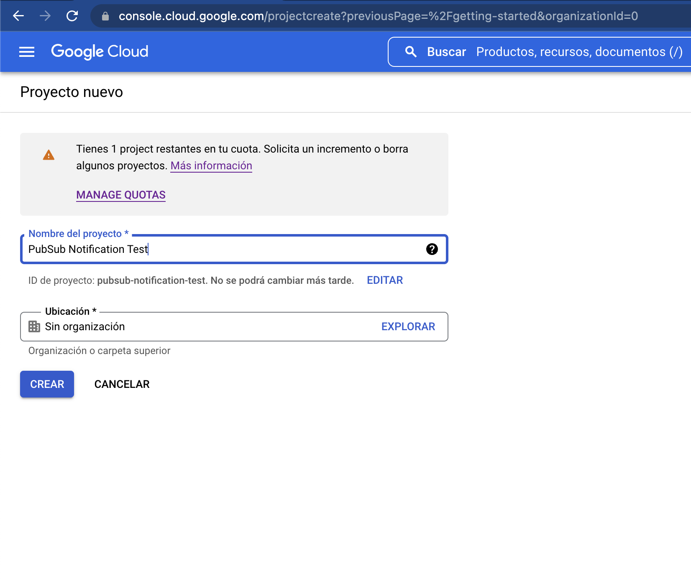

# Enviando mensaje a través del servicio Pub/Sub usando GCP

## Creación de proyecto en GCP

Para la creación de un proyecto nuevo.

- Selecciona un proyecto


- Aparecerá un Pop Up, seleccionar Proyecto Nuevo


- Nombrar el proyecto
- Crear



Una vez que hemos creado el proyecto, en el menú superior seleccionamos `Selecciona un proyecto` y en el PopUp seleccionamos el proyecto que recientemente hemos creado.

Una vez que hayamos seleccionado el proyecto, quedará el nombre seleccionado en la parte superior indicándonos que ya estamos dentro.

Hacemos una búsqueda tecleando en la parte superior `Pub/Sub` y seleccionamos el servicio.

Ya dentro del menú de **Pub/Sub**, crearemos un tema.


## Creación de Tema

- Oprimimos el botón `Crear Tema` del menú superior.


- Nombramos el y oprimimos `Crear Tema`.


Para poder "*escuchar*" los mensajes de un tema, debemos crear una suscripción dentro del tópico deseado.

Una vez que hayamos creado el tema, nos llevará a una pantalla interna para poder crear suscripciones. Aunque por default se crea una suscripción, crearemos una completamente nueva.

## Creación de Suscripción

- Seleccionar la opción `Crear Suscripción`.


- Asignamos un ID a la suscripción.
- Nos aseguramos de que en `Nombre del tema` esté seleccionado el correcto. En este caso solo aparece uno, pero cuando existen más "*temas*", tenemos la opción de cambiarlo.
- Nos aseguramos que el *Tipo de envío* esté seleccionado.
- Todos los demás valores quedan por *default*.
- Creamos la suscripción.


Una vez que el tema y la suscripción han sido creados, es hora de tramitar los permisos de acceso a esa información desde nuestro proyecto configurando una `Cuenta de Servicio`.

## Cuenta de Servicio

Desde el menú principal (3 líneas horizontales) seleccionamos `IAM Y administración` > `Cuentas de servicio`.


- PASO 1: 
-- Seleccionamos `Crear cuenta de servicio` desde el menú superior.
-- Escribimos un nombre y una descripción. El ID de la cuenta se genera automáticamente.
-- Oprimimos `Crear y Continuar`


- PASO 2: 
-- Otorgamos el rol de la cuenta de servicio seleccionando `Usadas actualmente` > `Propietario`


-- Oprimimos `Continuar`
-- Oprimimos `Listo`


La Cuenta de Servicio ha sido creada. Ahora, tendremos que tramitar las llaves de acceso para configurarlas en nuestro proyecto.

## Generar llave de acceso

- Hacer clic sobre la `Cuenta de Servicio` que acabamos de crear.
- En la pantalla siguiente, seleccionar `Claves` en el menú superior.


- Oprimimos `Agregar Clave` > `Crear clave nueva`


- Esto nos desplegará una ventana en donde nos dice que la clave se generará en formato `JSON` (recomendada) y hacemos click en `Crear`


Una vez terminado este paso, la llave automáticamente se descargará en nuestro equipo. **Favor de ubicarla y guardarla en un lugar seguro, ya que las claves no se pueden regenerar.**


## Configuración de Llave JSON en nuestro equipo.

Para esta prueba, guardaremos la clave fuera de nuestro proyecto en una carpeta llamada `~./keys`

Para que la llave `JSON` pueda ser utilizada desde nuestro proyecto, es importante exportar su ruta absoluta en la variable de entorno `GOOGLE_APPLICATION_CREDENTIALS` con un simple export desde la terminal. 

En mi caso, la guardaré y expondré su ubicación desde el archivo `~/.bashrc` de la siguiente manera

- Abrir el archivo `~/.bashrc`
- Agregar la siguiente línea haciendo las correcciones pertinentes según el usuario.

```
export GOOGLE_APPLICATION_CREDENTIALS="/Users/humberto.contreras/keys/pubsub-notification-test-08ce63cbe9a9.json"
```

- Grabamos el archivo.

Una vez que hemos grabado el archivo `~./bashrc`, hay que reflejar los cambios con la siguiente línea.

```
Source ~./bashrc
```

Para comprobar los cambios, tecleamos el siguiente comando para verificar que podamos obtener la ruta asignada en la variable de entorno.

```
printenv GOOGLE_APPLICATION_CREDENTIALS
```


Una vez hecho esto y verificando el valor de la variable, es hora de preparar nuestro proyecto NodeJS.

## Proyecto NodeJS

Una vez dentro del proyecto, hacer un `npm i` para instalar las dependencias. Una dependencia importante para el tema **Pub/Sub** es `@google-cloud/pubsub`

Una vez instalados todos los paquetes, hacer un `npm run dev`.

Para efectos de este demo, el código principal que recibe los mensajes desde nuestra suscripción se encuentra ubicado en `/pubsub/index.js` 

## Envío de mensaje desde GCP

Dentro de GCP

- Entrar en `Pub/Sub` > `Temas` > Clic al tema.
- Entrar en la opción `Mensajes`, en el menú que está ubicado a mitad de pantalla.
- Oprimir en `Publicar Mensaje`.

Aparecerá un PopUp en donde podemos escribir el mensaje que enviaremos a nuestro tópico.

En este caso, enviaremos el mensaje *“Prueba de mensaje desde Google Cloud Platform using Pub/Sub”* Oprimimos `Publicar`.

El mensaje ha llegado a la consola.


## Referencias útiles

- https://developer.android.com/google/play/billing/rtdn-reference
- https://medium.com/@jmn8718/in-app-purchases-notifications-4408c3ee88eb

